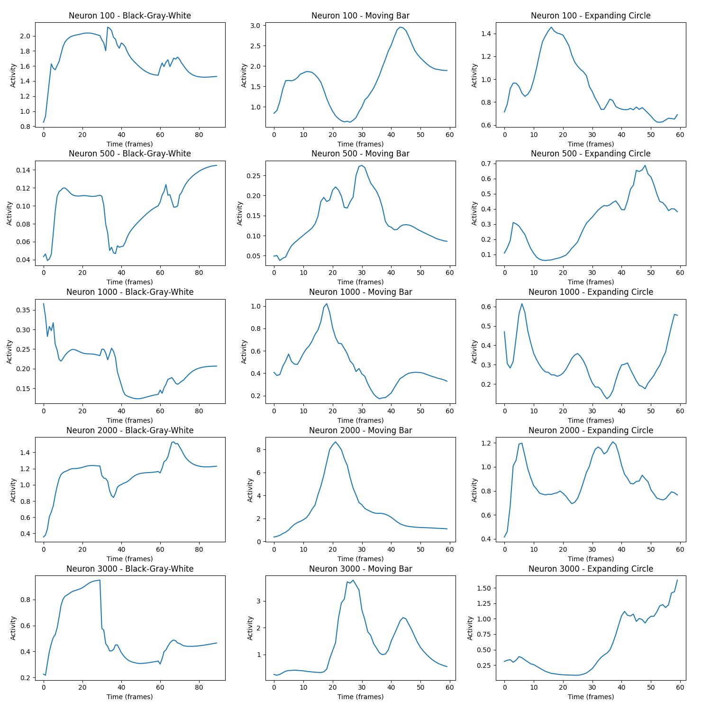
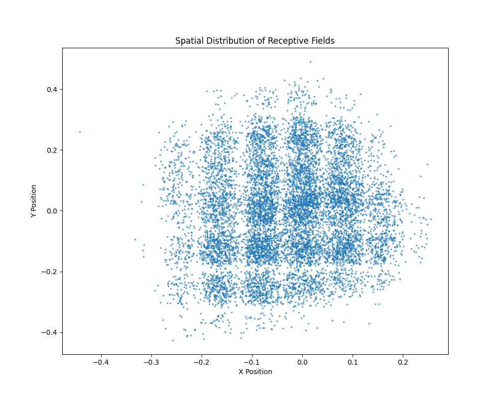
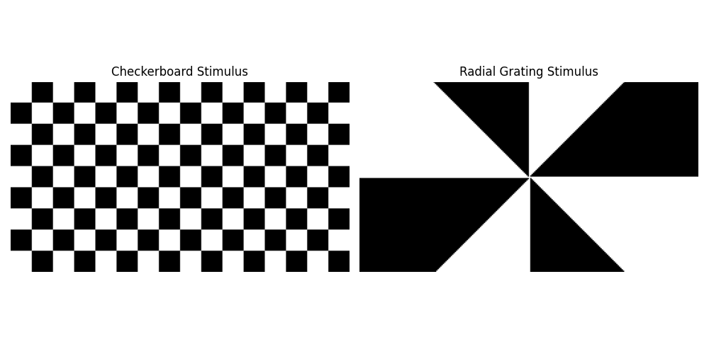
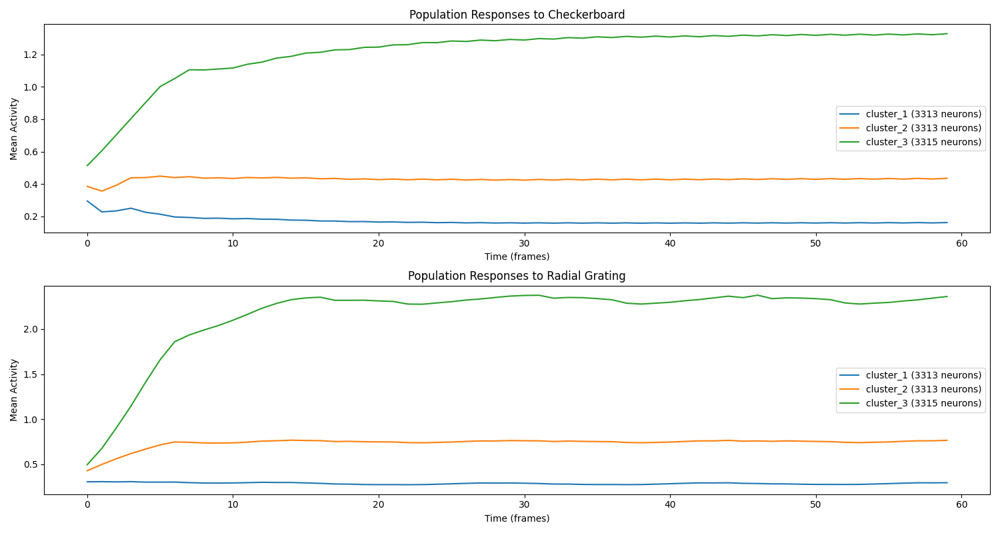
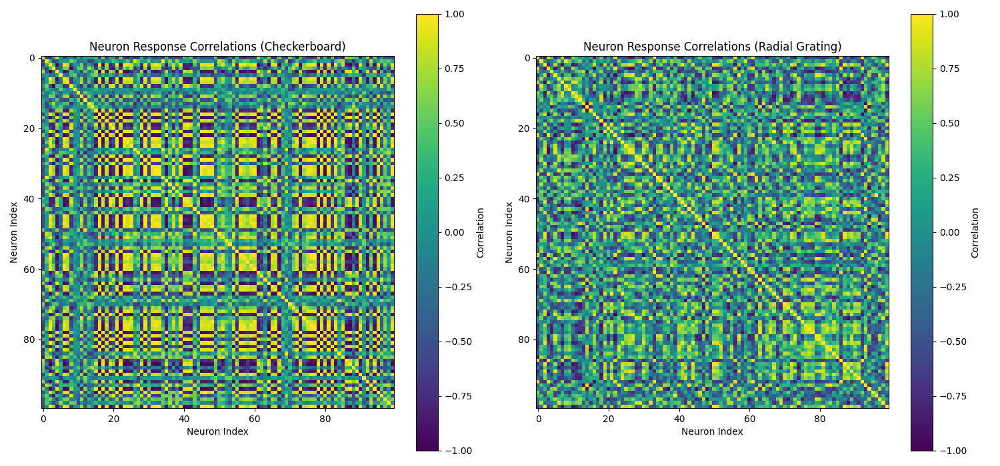

# FNN 基础神经网络模型实验报告

## 摘要

本实验报告探讨了基础神经网络(FNN)模型在预测小鼠视觉皮层神经元对不同视觉刺激反应方面的能力。FNN 是一个基于深度学习的模型，能够模拟小鼠视觉系统对多种视觉刺激的反应。本实验测试了模型对三种不同类型刺激的处理能力——简单的亮度变化、移动条纹和扩张圆形图案，并分析了神经元感受野的空间分布。实验结果表明，FNN 模型能够捕捉不同神经元对各种视觉刺激的独特反应模式，展示了其作为视觉皮层通用计算模型的潜力。

## 1. 引言

基础神经网络(Foundation Neural Networks, FNN)是在 Wang 等人(2025)的论文"Foundation model of neural activity predicts response to new stimulus types"中提出的模型。该模型旨在预测小鼠视觉皮层神经元对各种视觉刺激的反应，不仅限于训练数据中包含的刺激类型。本实验的目的是验证 FNN 模型在处理不同类型视觉刺激时的性能，并探索神经元感受野的空间分布特征。

## 2. 模型原理与架构

### 2.1 基本原理

FNN 模型基于深度学习技术，通过组合数据驱动的方法和神经科学知识，创建了小鼠视觉皮层的功能模型。该模型从大规模神经活动数据中学习，能够在不需要重新训练的情况下泛化到新的刺激类型和不同的小鼠个体。

模型的核心理念是：
1. **跨域泛化**：通过学习神经活动的普遍表示，能够预测对未见过的刺激类型的反应
2. **功能条形码**：每个神经元由特定的参数组合表征，反映其解剖和功能特性
3. **3D光学模拟**：考虑小鼠视角的刺激转换，更准确地模拟视觉信息处理

### 2.2 模型架构

FNN 模型由四个主要模块组成，形成了一个完整的视觉信息处理流水线：

1. **透视模块** (Perspective Module)
   - 功能：使用光线追踪技术，将监视器上的视觉刺激转换为基于小鼠眼睛位置和方向的视网膜表示
   - 实现：`fnn/model/perspectives.py`
   - 核心组件：
     - 监视器模型：3D表示显示器
     - 视网膜模型：球面表示接收光线的视网膜
     - 像素转换：处理强度变换

2. **调制模块** (Modulation Module)
   - 功能：处理行为变量（如运动、瞳孔大小）对视觉处理的影响
   - 实现：`fnn/model/modulations.py`
   - 核心组件：
     - LSTM 网络：维持行为状态的动态表示
     - 调制特征图：影响后续视觉处理的调制信号

3. **核心模块** (Core Module)
   - 功能：主要的视觉信息处理模块，包含大部分模型容量
   - 实现：`fnn/model/cores.py`
   - 核心组件：
     - 前馈组件：使用3D卷积和DenseNet架构提取空间特征
     - 循环组件：使用CvtLstm（卷积视觉变换器LSTM）处理时间动态

4. **读出模块** (Readout Module)
   - 功能：将核心模块的输出映射到单个神经元的活动
   - 实现：`fnn/model/readouts.py`
   - 核心组件：
     - 空间位置：表示神经元在视觉空间中的位置（感受野中心）
     - 特征权重：表示神经元对不同视觉特征的选择性

### 2.3 数据流

1. **输入**：视觉刺激序列（视频帧），形状为 `[T, H, W]`，其中：
   - T: 时间帧数
   - H: 图像高度 (144像素)
   - W: 图像宽度 (256像素)
   - 每个像素值范围为0-255（8位灰度图像）

2. **内部处理**：
   - 透视模块将刺激转换为视网膜表示
   - 调制模块生成行为调制信号
   - 核心模块提取时空特征
   - 读出模块映射到神经元活动

3. **输出**：神经元反应序列，形状为 `[T, N]`，其中：
   - T: 时间帧数（与输入相同）
   - N: 神经元数量 (本例中为9941个神经元)
   - 每个值表示特定时间点特定神经元的活动水平（发放率）

## 3. 实验方法

### 3.1 环境设置

- Python 3.11.11
- PyTorch 2.6.0
- 其他依赖：pandas, numpy, matplotlib

### 3.2 实验设计

我们设计了五种不同类型的视觉刺激来测试模型的泛化能力：

1. **基本亮度序列**：黑-灰-白序列，每种30帧，共90帧
   - 黑色帧：所有像素值为0
   - 灰色帧：所有像素值为128
   - 白色帧：所有像素值为255

2. **移动条刺激**：垂直条从左向右移动，60帧
   - 条宽：20像素
   - 条高：144像素（全高）
   - 背景：黑色（像素值0）
   - 条颜色：白色（像素值255）

3. **扩张圆刺激**：中心圆形随时间扩张和收缩，60帧
   - 圆心：图像中心(128, 72)
   - 半径：在20到60像素之间按正弦规律变化
   - 背景：黑色（像素值0）
   - 圆形：白色（像素值255）

4. **棋盘格刺激**：具有交替黑白方格的棋盘图案，60帧
   - 方格大小：16×16像素
   - 模式：在帧之间交替相位（黑变白，白变黑）
   - 覆盖整个图像区域(144×256像素)

5. **辐射光栅刺激**：从中心向外辐射的扇形图案，60帧
   - 中心位置：图像中心(72, 128)
   - 分段：8个交替的黑白扇形区域
   - 旋转：光栅随时间逐渐旋转一周
   - 覆盖整个图像区域

### 3.3 数据分析

1. 使用 FNN 模型预测每种刺激类型的神经反应
2. 对不同刺激类型的神经反应进行统计分析（均值、标准差）
3. 选择5个代表性神经元（ID：100, 500, 1000, 2000, 3000）可视化其对不同刺激的反应
4. 提取并可视化所有神经元感受野的空间分布

## 4. 实验结果

### 4.1 模型性能

FNN 模型能够高效处理所有三种视觉刺激类型：

| 刺激类型 | 帧数 | 处理时间(秒) | 平均反应强度 | 反应标准差 |
|---------|-----|------------|------------|-----------|
| 黑-灰-白序列 | 90 | 5.51 | 0.5382 | 0.6431 |
| 移动条刺激 | 60 | 3.71 | 0.7627 | 1.4850 |
| 扩张圆刺激 | 60 | 3.69 | 0.7872 | 1.4182 |

注意到移动条和扩张圆刺激产生的平均神经反应强度更高，且变异性（标准差）更大，表明这些动态刺激比静态亮度变化能够激发更强更多样的神经反应。

### 4.2 神经元反应特征

选定神经元对不同刺激的反应模式显示出显著差异：

从图中可以观察到以下特征：

1. **神经元100**：
   - 对黑-灰-白序列：在刺激开始时迅速激活，之后保持较高活动
   - 对移动条：呈现单峰反应，当条移动到特定位置时达到最大反应
   - 对扩张圆：随圆形扩张出现峰值反应，收缩时反应减弱

2. **神经元500**：
   - 对黑-灰-白序列：对灰色帧保持稳定反应，在过渡时反应变化
   - 对移动条：显示多峰反应，可能对条边缘敏感
   - 对扩张圆：在圆形最大时反应最强

3. **神经元1000**：
   - 对黑-灰-白序列：在刺激初始阶段反应最强，然后逐渐适应
   - 对移动条：呈现清晰的单峰反应，表明有明确定义的空间感受野
   - 对扩张圆：复杂的多峰反应，可能对圆形边缘的不同位置有选择性

4. **神经元2000**：
   - 对黑-灰-白序列：对不同亮度区域有不同稳态反应
   - 对移动条：强烈的单峰反应，反应强度明显高于其他刺激
   - 对扩张圆：复杂的时间模式，多次峰值可能对应圆形扩张和收缩

5. **神经元3000**：
   - 对黑-灰-白序列：黑到灰的过渡引起强烈反应，之后适应
   - 对移动条：两个明显的峰值，可能对应条的前后边缘
   - 对扩张圆：反应随时间稳步增加，显示累积效应

这些差异表明每个神经元都有独特的功能特性和刺激选择性，这与真实的视觉皮层神经元特性一致。

### 4.3 感受野空间分布

感受野位置的空间分布展示了模型所表示的神经元在视觉空间中的组织：

从分布图中可以观察到：

1. 感受野覆盖了整个视觉空间，但分布不均匀
2. 视野中心区域（接近原点）神经元密度更高
3. 出现了几个明显的垂直带状结构
4. 分布范围近似椭圆形，水平轴（X轴）范围约-0.4到0.2，垂直轴（Y轴）范围约-0.4到0.4
5. 存在一些离群点，表明某些神经元的感受野位于视野的极端位置

这种分布模式反映了生物视觉系统中的特性，如中心凹区域（视野中心）有更高的神经元密度以提供更精细的视觉信息处理。

## 5. 讨论

### 5.1 主要发现

1. **刺激类型对神经反应的影响**：
   - 动态刺激（移动条和扩张圆）产生更强、更多样的神经反应
   - 不同神经元对相同刺激表现出独特的反应模式
   - 某些神经元对特定刺激类型表现出明显的选择性

2. **神经元功能多样性**：
   - 观察到多种反应模式：瞬态反应、持续反应、单峰反应、多峰反应
   - 时间动态多样：快速适应、延迟反应、累积效应
   - 空间选择性：对刺激位置、边缘和运动方向的选择性反应

3. **视觉空间表示**：
   - 感受野分布反映了生物视觉系统的组织原则
   - 中心区域表示更密集，符合生物视网膜和视觉皮层的组织

### 4.4 神经元群体对复杂刺激的反应

除了基本刺激外，我们还测试了模型对结构更复杂的棋盘格与辐射光栅刺激的反应。这些刺激代表了视觉系统处理的更高级特征，如空间频率、方向和运动：

我们对神经元按其活动水平进行聚类，得到了三个主要的神经元群体（每组约3300个神经元）。这三个群体展示了不同的反应特性：

| 刺激类型 | 低活动群体 (均值) | 中等活动群体 (均值) | 高活动群体 (均值) |
|---------|---------------|-----------------|---------------|
| 棋盘格刺激 | 0.1733 | 0.4290 | 1.2161 |
| 辐射光栅刺激 | 0.2850 | 0.7334 | 2.1655 |

主要观察结果：

1. **响应强度差异**：辐射光栅刺激引起的神经元活动整体上强于棋盘格刺激，所有群体的平均活动都更高
2. **时间动态**：高活动群体（群体3）在刺激开始后显示出明显的活动增强，之后达到稳态
3. **群体差异**：低活动群体（群体1）对两种刺激的反应都相对稳定且较弱，而高活动群体对刺激变化更敏感

此外，神经元之间的相关性分析揭示了神经元连接模式的差异：

1. **棋盘格刺激**产生了更加结构化的相关性模式，显示出清晰的块状结构，表明特定神经元群体对棋盘格刺激的各个部分有协调一致的反应
2. **辐射光栅刺激**产生了更加分散的相关性模式，主要沿对角线显示正相关，表明神经元主要与自身活动模式相关，而与其他神经元的协同活动较少

这些差异表明FNN模型能够捕捉到不同类型视觉刺激诱发的独特神经活动模式，反映了视觉皮层中不同神经元群体对特定视觉特征的选择性。

### 5.2 模型能力与局限性

**能力**：
- 成功处理多种类型的视觉刺激，包括静态、动态和复杂图案刺激
- 捕捉到不同神经元的独特功能特性及其群体行为
- 表现出与生物视觉系统一致的空间组织原则
- 能够区分不同神经元群体对特定视觉特征的选择性反应

**局限性**：
- 本实验中使用的刺激仍相对人工，未测试更自然的场景刺激
- 未包含行为变量（如眼动、运动）对神经反应的调制效应
- 聚类分析采用简单的活动水平分组，可能未能充分捕捉神经元功能多样性
- 未深入分析神经元类型与其反应特性的关系

### 5.3 未来方向

1. 测试更复杂和生态相关的视觉刺激，如自然场景视频
2. 探索行为状态对神经反应的调制作用
3. 分析神经元类型与其功能特性的关系
4. 比较模型预测与实际神经记录数据
5. 探索模型在神经科学和人工智能应用中的潜力

## 6. 结论

FNN 模型展示了作为小鼠视觉皮层功能模型的强大能力。它能够处理不同类型的视觉刺激，为每个神经元生成独特的反应模式，并表现出与生物视觉系统一致的空间组织原则。实验结果支持 FNN 作为视觉皮层通用计算模型的潜力，为理解视觉信息处理和开发生物启发的人工智能系统提供了宝贵工具。

## 参考文献

1. Wang Y, et al. (2025). Foundation model of neural activity predicts response to new stimulus types. Nature.
