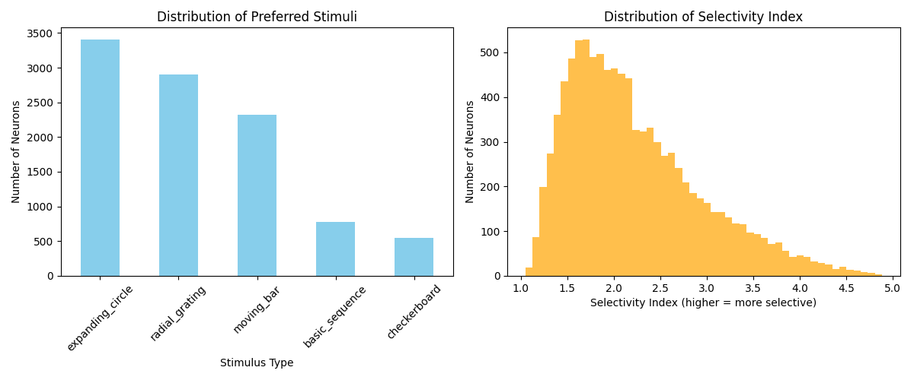
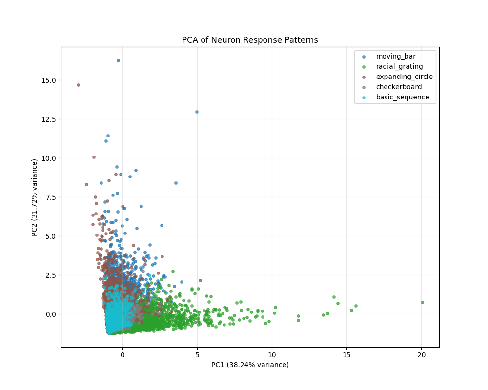
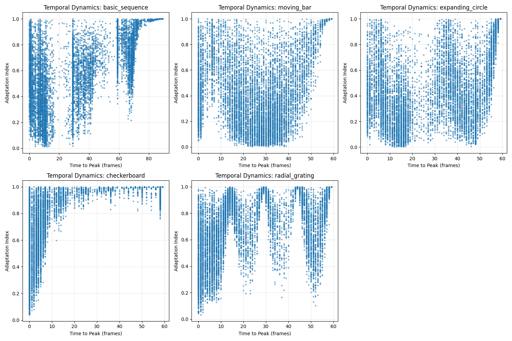

# FNN 神经元特性分析报告

## 引言

本报告详细分析了基础神经网络（Foundation Neural Network, FNN）模型中神经元的功能特性和反应模式。基于对不同类型视觉刺激的处理结果，我们探究了模型中近10,000个神经元的刺激选择性、时间动态特性和空间组织原则。这些分析对理解模型作为视觉皮层功能模拟的能力提供了深入洞察。

## 方法

我们设计了五种不同类型的视觉刺激来测试模型中的神经元特性：

1. **基本亮度序列**（basic_sequence）：黑-灰-白序列，90帧
2. **移动条刺激**（moving_bar）：垂直条从左向右移动，60帧
3. **扩张圆刺激**（expanding_circle）：中心圆形随时间扩张和收缩，60帧
4. **棋盘格刺激**（checkerboard）：交替黑白方格模式，60帧
5. **辐射光栅刺激**（radial_grating）：从中心向外辐射的扇形图案，随时间旋转，60帧

对每个神经元，我们计算了以下指标：

- **刺激偏好**：对每个神经元确定引发最大反应的刺激类型
- **选择性指数**：最大反应与平均反应的比值，较高的值表示更强的刺激特异性
- **时间动态特征**：
  - 峰值时间：达到最大反应的帧索引
  - 适应指数：最终反应与最大反应的比值，值越接近0表示适应越强
- **反应模式相似性**：通过主成分分析（PCA）将神经元的反应模式可视化

## 主要发现

### 1. 刺激偏好分布

分析表明，模型中的神经元对不同刺激类型表现出明显的偏好差异：

| 刺激类型 | 偏好神经元数量 | 百分比 |
|---------|-------------|-------|
| 扩张圆刺激 | 3,407 | 34.3% |
| 辐射光栅刺激 | 2,901 | 29.2% |
| 移动条刺激 | 2,318 | 23.3% |
| 基本亮度序列 | 772 | 7.8% |
| 棋盘格刺激 | 543 | 5.5% |

这一分布表明：
- 动态且具有径向对称性的刺激（如扩张圆）激发了最多神经元的最强反应
- 复杂的空间模式（辐射光栅）和定向运动（移动条）也能引起大量神经元的强烈反应
- 简单的亮度变化和重复性图案对较少神经元最具刺激性

### 2. 选择性分析

神经元的选择性指数分布显示：
- 平均选择性指数：2.227
- 最大选择性指数：4.885
- 最小选择性指数：1.047

选择性指数分布呈右偏分布，大多数神经元的选择性指数在1.5-3.0之间，表明模型中既有对特定刺激高度选择性的专门神经元，也有对多种刺激均有反应的通用神经元。这种多样性与真实视觉皮层的特性一致。

### 3. 神经元反应模式

使用主成分分析（PCA）对神经元的反应模式进行降维可视化，揭示了不同刺激偏好神经元的组织：

从PCA图中可以观察到：
- 具有不同刺激偏好的神经元在特征空间中形成了相对聚集的群体
- 偏好辐射光栅的神经元（绿色）分布更广，部分位于特征空间的远端
- 偏好移动条（蓝色）和扩张圆（棕色）的神经元表现出一定程度的重叠
- PC1解释了38.24%的方差，PC2解释了31.72%的方差，表明神经元的反应模式可以由相对较少的维度捕捉

这种组织模式表明，尽管神经元的刺激偏好有明确区分，但它们的基本反应特性仍存在共享的特征空间。

### 4. 时间动态特性

分析神经元对不同刺激的时间动态特性，揭示了丰富的时间编码模式：

各刺激类型的时间动态特点：

1. **基本亮度序列**：
   - 显示两个主要的峰值时间集群：早期（0-20帧）和晚期（60-80帧）
   - 早期峰值可能对应黑到灰的过渡，晚期峰值对应灰到白的过渡
   - 适应指数分布广泛，表明神经元对亮度变化有多种适应程度

2. **移动条刺激**：
   - 峰值时间均匀分布在整个序列中
   - 表明不同神经元对条在不同空间位置最敏感
   - 适应指数与峰值时间呈弱正相关，表明条刺激早期反应的神经元往往适应更强

3. **扩张圆刺激**：
   - 峰值时间分布类似于移动条，但更倾向于分布在中间帧
   - 适应指数分布较广，表明复杂的适应模式

4. **棋盘格刺激**：
   - 峰值时间主要集中在序列开始（0-10帧）
   - 大多数神经元对初始棋盘格模式有强烈反应，之后迅速适应
   - 适应指数呈双峰分布，表明部分神经元完全适应，部分保持持续反应

5. **辐射光栅刺激**：
   - 峰值时间呈周期性分布（约0、20、40、60帧），与光栅的旋转同步
   - 表明不同神经元对不同方向的辐射图案有选择性
   - 适应指数变化大，表明复杂的时间编码

这些时间动态特性揭示了神经元丰富的时间编码能力，能够捕捉刺激的不同时间特征。

## 讨论

### 功能意义

1. **刺激特异性编码**：
   - 不同神经元对特定刺激类型的选择性表明模型形成了专门化的特征检测器
   - 这种组织与生物视觉系统中发现的功能柱结构相似

2. **时间信息处理**：
   - 峰值时间和适应特性的多样性表明模型能够有效编码刺激的时间动态
   - 这对于动态视觉场景的处理至关重要

3. **神经元多样性**：
   - 选择性指数的分布表明模型包含不同程度专一性的神经元
   - 高选择性神经元可能用于精确特征检测，低选择性神经元可能用于一般场景理解

### 与生物视觉系统的比较

这些发现与生物视觉皮层的多项特性一致：

1. 视觉皮层神经元对特定视觉特征（如方向、大小、运动）的选择性
2. 神经元适应机制的多样性，从快速适应到持续反应
3. 功能组织的存在，类似于视觉皮层中的功能柱结构

## 结论

FNN模型中的神经元展示了丰富的功能特性和组织原则，包括刺激选择性、时间动态编码和功能结构。这些特性使模型能够对各种视觉刺激产生差异化和时间相关的反应，这对于视觉信息的有效处理至关重要。

这些发现支持FNN作为小鼠视觉皮层功能模型的有效性，并为理解视觉信息处理的神经机制提供了宝贵的计算模型。未来研究可以进一步探索这些神经元特性与具体视觉任务性能的关系，以及与实际生物数据的定量比较。
